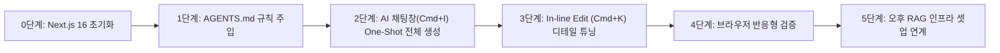

# [Hands-on] Cursor로 1시간 만에 만드는 모던 SaaS 랜딩 페이지

> **과정명**: 개발자를 위한 클로드 코드와 커서 AI 실전 (Day 1 오전 실습)  
> **실습 주제**: Cursor Free 티어로 1시간 만에 프로덕션 수준의 SaaS 랜딩 페이지 구축하기  
> **예상 소요 시간**: 60분 (환경 준비 포함 / 핵심 구현 10분 + 디테일 수정 10분 + 보너스 미션·질의응답 나머지)  
> **핵심 기술 스택**: Next.js 16 (App Router), TypeScript, Tailwind CSS, Lucide React  
> **핵심 학습 도구**: Cursor IDE (AI 채팅창(Agent), `AGENTS.md`, In-line Edit `Cmd+K`, Cursor Tab)

---

## 📌 실습 개요 및 목표

오늘 첫 시간의 목표는 **"AI 에디터가 개발자의 생산성을 어떻게 10배 이상 폭발시키는지"**를 직접 경험하는 것입니다.

우리는 가상의 AI 글쓰기 어시스턴트 SaaS 서비스인 **'WriteFlow'**의 고전환율 랜딩 페이지를 만듭니다.  
특히 이번 실습은 **Cursor Free 티어의 제한된 크레딧을 철저히 아끼면서, 단 1~2회의 요청으로 완성도 95% 이상의 결과물을 뽑아내는 One-Shot 프롬프팅 기법**을 체화합니다.

> [!NOTE]
> **시간과 크레딧 안내**
> - One-Shot 생성만으로 **약 10분**이면 랜딩 페이지가 완성되고, 여기서 Free 크레딧을 **절반 남짓** 사용합니다.
> - 디테일 수정·반응형 검증까지 하면 **20분**, 보너스 미션까지 하면 크레딧을 거의 다 쓰게 됩니다.
>
> **크레딧이 시간보다 먼저 바닥납니다.** "한 번에 제대로 요청하기"가 이 실습의 진짜 훈련 포인트입니다.



---

## 0단계: 환경 준비 & Next.js 프로젝트 생성

> [!IMPORTANT]
> 아래 0.1~0.4를 실행하며 환경을 맞춥니다.
> - Node.js LTS 설치 (`node -v`로 v20 이상 확인)
> - Cursor 설치 및 로그인
> - `npx create-next-app` 및 `npm install lucide-react` 실행

### 0.1 Node.js 설치 (Windows / macOS)

먼저 터미널에서 설치 여부를 확인합니다. 버전이 **v20 이상**으로 나오면 이 단계는 건너뜁니다.

```bash
node -v
npm -v
```

#### 🪟 Windows (PowerShell)
PowerShell을 **관리자 권한**으로 실행한 뒤 `winget`으로 설치합니다.

```powershell
winget install OpenJS.NodeJS.LTS

# npx 실행 시 보안 오류가 나면 스크립트 실행 권한 허용
Set-ExecutionPolicy RemoteSigned -Scope CurrentUser
```
> 💡 설치 후에는 **PowerShell 창을 닫았다가 다시 열어야** `node` 명령이 인식됩니다.
> `winget`이 없다면 [nodejs.org](https://nodejs.org)에서 LTS 설치 파일(.msi)을 내려받아 실행하세요.

#### 🍎 macOS (Homebrew)
```bash
# Homebrew가 없다면 먼저 설치
/bin/bash -c "$(curl -fsSL https://raw.githubusercontent.com/Homebrew/install/HEAD/install.sh)"

brew install node
```
> 💡 Homebrew 설치가 부담되면 [nodejs.org](https://nodejs.org)의 LTS `.pkg` 파일로도 동일하게 설치됩니다.

#### 설치 확인
```bash
node -v   # v20.x 이상
npm -v
```

### 0.2 실습 폴더 생성 및 이동
터미널을 열고 새 프로젝트 디렉토리를 생성합니다.

```bash
# macOS / Linux
mkdir -p ~/dev/writeflow-landing
cd ~/dev/writeflow-landing

# Windows (PowerShell)
New-Item -ItemType Directory -Force -Path $HOME\dev\writeflow-landing
Set-Location $HOME\dev\writeflow-landing
```

### 0.3 Next.js 16 프로젝트 초기화
현재 폴더(`.`)에 Next.js 프로젝트를 생성합니다.

```bash
npx create-next-app@latest . --typescript --tailwind --eslint --app --src-dir --import-alias "@/*" --use-npm
```
> 💡 *설치 중 프롬프트가 뜨면 모두 기본값(Enter)으로 진행하세요.*

### 0.4 아이콘 패키지 설치
모던 웹 디자인의 필수품인 `lucide-react`를 설치합니다.

```bash
npm install lucide-react
```

### 0.5 Cursor로 프로젝트 열기
```bash
# Cursor CLI가 등록되어 있다면
cursor .

# 또는 Cursor 프로그램을 실행한 뒤 [File] -> [Open Folder...]로 ~/dev/writeflow-landing 열기
```

---

## 1단계: Cursor에 프로젝트 룰 심기 (`AGENTS.md`)

Cursor의 가장 강력한 기능 중 하나는 **프로젝트 규칙**입니다.
프로젝트 루트에 규칙 파일을 두면, Cursor의 모든 AI 모델이 코드를 작성할 때 이 규칙을 최우선으로 준수합니다.

> [!TIP]
> **왜 `.cursorrules`가 아니라 `AGENTS.md`인가요?**
> - `.cursorrules`는 **레거시**입니다. 아직 동작하지만 에디터가 deprecated 경고를 띄웁니다.
> - `AGENTS.md`는 Cursor뿐 아니라 **Claude Code 등 다른 AI 코딩 도구도 함께 읽는 공용 규칙 파일**입니다.
>   도구를 바꿔도 규칙을 다시 쓸 필요가 없습니다. (오후 실습에서 그대로 재사용합니다.)
> - 형식은 그냥 **마크다운 한 장**이라 배우기도 쉽습니다.
>
> 셋 다 Cursor 공식 문서 [Rules](https://cursor.com/help/customization/rules)에 명시된 내용입니다.
> ("The `.cursorrules` file in your project root is legacy and will be deprecated." /
> "Create an `AGENTS.md` file in your project root... Cursor picks it up automatically.")
>
> 규칙이 많아져 파일 하나로 관리하기 버거워지면, Cursor 전용 기능인
> **`.cursor/rules/*.mdc`** (Project Rules)로 쪼개면 됩니다.
> `.mdc`는 규칙을 **여러 파일로 나누고 적용 대상(glob)을 지정**할 수 있어 프로젝트가 커질수록 유리합니다.
>
> ```
> .cursor/
>   └── rules/
>       └── design-system.mdc     # 상단에 description / globs / alwaysApply 프론트매터 추가
> ```

### 1.1 `AGENTS.md` 파일 생성
Cursor 에디터에서 프로젝트 루트에 `AGENTS.md` 파일을 생성하고 아래 내용을 붙여넣습니다.

```markdown
# WriteFlow 랜딩 페이지 규칙

## 디자인 시스템 & 스타일
- 프레임워크: Next.js 16 (App Router), Tailwind CSS
- 컬러 팔레트:
  - 메인: 인디고 (#4F46E5, indigo-600)
  - 보조: 바이올렛 (#7C3AED, violet-600)
  - 배경: slate-900 또는 흰색 + 은은한 그라데이션 (인디고/바이올렛 계열 포인트)
- 타이포그래피: 깔끔한 산세리프, 높은 대비, 크고 굵은 헤드라인
- 컴포넌트: 모바일 우선(Mobile First) 완전 반응형, 아이콘은 Lucide React 사용

## 컴포넌트 작성 지침
- Header: 블러 배경이 적용된 상단 고정 내비게이션 (`backdrop-blur-md bg-white/80 dark:bg-slate-900/80`)
- Hero: 명확한 가치 제안 문구, CTA 버튼 2개, 그라데이션 헤드라인 텍스트
- Features: 3x2 그리드 카드, 마우스 오버 시 테두리/그림자 애니메이션
- Pricing: 3단계 요금제 카드(Free, Pro, Enterprise) + 월간/연간 전환 토글
- FAQ: 부드러운 열림/닫힘 전환이 있는 접근성 고려 아코디언
- 모든 컴포넌트는 모듈 단위로 나눠 `src/components/`에 배치할 것
- 'use client'는 상태나 클릭 이벤트 등 상호작용이 필요한 경우에만 사용할 것
```

---

## 2단계: AI 채팅창에 One-Shot으로 전체 구현 요청

Cursor의 AI 채팅창은 여러 파일을 한 번에 만들고 고칠 수 있습니다.
쿼터를 아끼기 위해 아래의 **[One-Shot 구조화 프롬프트]**를 통째로 복사해서 한 번에 전달합니다.

### 2.1 채팅창 열기
- **macOS**: `Cmd + I`
- **Windows**: `Ctrl + I`

> [!NOTE]
> 예전 자료에 나오는 **"Composer"**가 지금의 이 채팅창입니다. 별도 메뉴를 찾지 마세요.
> 채팅창 하단의 모드가 **Agent**로 되어 있는지만 확인하면 됩니다. (Ask 모드는 질문만 하고 파일을 만들지 않습니다.)
> 모델은 Free 플랜 기본값(예: `Cursor Grok 4.6`) 그대로 두고 진행해도 결과에 문제 없습니다.

### 2.2 One-Shot 프롬프트 입력
채팅창에 아래 내용을 그대로 붙여넣고 전송합니다.

> 💬 **One-Shot 프롬프트**
> ```text
> AI 글쓰기 SaaS 'WriteFlow'의 고전환율 랜딩 페이지 전체를 구현해줘.
> 
> [컴포넌트 분리 요구사항]
> `src/components/` 디렉토리에 다음 컴포넌트들을 각각 분리하여 생성하고, `src/app/page.tsx`에서 조합해줘:
> 
> 1. `Header.tsx` ('use client'):
>    - 로고 ("WriteFlow" + 반짝이는 연필/스파클 아이콘)
>    - 네비게이션 링크: 기능 소개, 요금제, FAQ
>    - 우측: [로그인], [무료 체험 시작] CTA 버튼
>    - 모바일 햄버거 메뉴 토글 지원
> 
> 2. `Hero.tsx`:
>    - 뱃지: "✨ 2026 차세대 AI 에디터 출시"
>    - 메인 헤드라인: "AI와 함께 더 빠르고, 더 완벽하게 쓰세요" (인디고-바이올렛 그라데이션)
>    - 서브카피: "아이디어를 몇 초 만에 완성도 높은 블로그, 기획서, 마케팅 카피로 변환합니다."
>    - CTA 버튼 2개: [14일 무료 체험] (강조), [1분 데모 영상 보기] (아웃라인)
>    - 신용카드 등록 불필요 안내 텍스트
>    - 가상 대시보드 미리보기 목업 UI 카드 (에디터 글쓰기 시연 느낌)
> 
> 3. `Features.tsx`:
>    - 3x2 반응형 그리드 (총 6개 기능 카드, Lucide 아이콘 포함):
>      ① 원클릭 콘텐츠 생성 (Sparkles 아이콘)
>      ② 실시간 문법 및 톤앤매너 교정 (CheckCircle 아이콘)
>      ③ 50개국 글로벌 다국어 번역 (Globe 아이콘)
>      ④ 100+ 맞춤 템플릿 제공 (LayoutTemplate 아이콘)
>      ⑤ 실시간 팀 협업 모드 (Users 아이콘)
>      ⑥ SEO 검색 최적화 자동 분석 (TrendingUp 아이콘)
>    - 각 카드에 호버 시 부드러운 확대 및 보라색 보더 발광 효과
> 
> 4. `Pricing.tsx` ('use client'):
>    - 월간 / 연간 결제 토글 스위치 (연간 선택 시 "20% 할인" 배지)
>    - 3가지 플랜 카드:
>      - Free ($0): 월 5개 문서, 기본 문법 검사
>      - Pro ($19/월, "가장 인기" 보라색 강조 배지): 무제한 생성, 고급 AI 모델, 우선 지원
>      - Enterprise ($49/월): 팀 공유 워크스페이스, 전담 매니저, SSO 인증
> 
> 5. `FAQ.tsx` ('use client'):
>    - 아코디언 형태로 클릭 시 열리고 닫히는 인터랙션 구현:
>      Q1. 무료 체험 기간 동안 신용카드 등록이 필요한가요?
>      Q2. 언제든지 구독을 취소할 수 있나요?
>      Q3. 제가 작성한 콘텐츠의 저작권은 누구에게 있나요?
>      Q4. 팀원들과 함께 공동 작업할 수 있나요?
>      Q5. 환불 정책은 어떻게 되나요?
> 
> 6. `Footer.tsx`:
>    - 회사 소개, 서비스 링크, 소셜 아이콘, 저작권 표기
> 
> 모든 코드는 타입 에러 없이 깔끔하게 동작해야 하며, 세련된 디자인으로 완성해줘.
> ```

### 2.3 제안 수락 (`Keep all`)
AI가 파일들을 생성하면서 코드 diff를 보여줍니다.  
우측 상단의 **[Keep all]** 버튼(단축키: `Cmd + Enter` / `Ctrl + Enter`)을 눌러 변경 사항을 모두 반영합니다.

---

## 3단계: Cursor In-line Edit (`Cmd+K`)과 Tab으로 디테일 다듬기

이제 개발자 실무에서 가장 많이 쓰이는 **In-line Edit (`Cmd+K` / `Ctrl+K`)**과 **Cursor Tab**을 실습합니다.

### 3.1 `Cmd+K`로 히어로 섹션 문구 수정하기
1. `src/components/Hero.tsx` 파일을 엽니다.
2. 메인 헤드라인 텍스트 영역을 마우스로 드래그하여 선택합니다.
3. 단축키 입력:
   - **macOS**: `Cmd + K`
   - **Windows**: `Ctrl + K`
4. 프롬프트 창에 다음을 입력하고 Enter:
   ```text
   헤드라인을 '생각의 속도로 글을 쓰다, WriteFlow'로 변경하고 글자 크기를 더 웅장하게 키워줘.
   ```
5. 생성된 diff를 확인하고 **[Keep]**을 누릅니다.

### 3.2 요금제에 "개발자 특가" 배지 달아보기
1. `src/components/Pricing.tsx` 파일을 엽니다.
2. Pro 플랜 카드의 상단 영역을 선택하고 `Cmd+K` (또는 `Ctrl+K`):
   ```text
   Pro 플랜 상단에 '🔥 실전 특강 한정 50% 할인' 깜빡이는 애니메이션 뱃지를 추가해줘.
   ```
3. 확인 후 **[Keep]**.

### 3.3 Cursor Tab 자동완성 경험하기
1. `src/components/Footer.tsx` 파일 하단으로 이동합니다.
2. 빈 줄에서 `// GitHub 저장소 링크 및 개발자 생존코딩 크레딧` 주석을 입력하고 Enter를 칩니다.
3. Cursor Tab이 회색 글씨로 제안하는 코드를 **`Tab` 키**를 눌러 수락합니다.

---

## 4단계: 반응형 및 로컬 구동 확인

### 4.1 개발 서버 실행
Cursor 하단 터미널(`Ctrl + ~` / `Cmd + ~`)에서 개발 서버를 실행합니다.

```bash
npm run dev
```

### 4.2 브라우저 확인
브라우저에서 `http://localhost:3000`에 접속합니다.

- [ ] **헤더**: 스크롤 시 상단에 고정되며 은은한 블러(Glassmorphism) 효과가 나는가?
- [ ] **히어로**: 그라데이션 타이틀과 CTA 버튼이 세련되게 배치되었는가?
- [ ] **기능 카드**: 마우스를 올렸을 때 호버 효과가 부드럽게 작동하는가?
- [ ] **요금제**: 월간/연간 토글 버튼을 눌렀을 때 가격 숫자가 인터랙티브하게 변하는가?
- [ ] **FAQ**: 아코디언을 클릭했을 때 질문이 부드럽게 펼쳐지는가?
- [ ] **모바일 뷰**: 개발자 도구(F12 ➡️ 디바이스 툴바)에서 모바일 화면으로 줄였을 때 햄버거 메뉴와 1열 레이아웃으로 잘 전환되는가?

---

## 5단계: 오전 미션 & Day 1 오후 연계 브릿지

### 🎯 오전 보너스 미션

- **미션 1 (다크 모드 지원)**: `Header.tsx`에 해/달 아이콘 버튼을 만들고 클릭 시 Tailwind의 `dark` 클래스를 토글하는 다크 모드 스위처를 `Cmd+K`로 구현해보세요.
- **미션 2 (소셜 증명 추가)**: Hero 섹션 아래에 "네이버, 카카오, 토스 등 500+ 기업 엔지니어가 신뢰하는 에디터" 로고 배너를 추가해보세요.
- **미션 3**: 남은 크레딧으로 자유롭게 수정해보기 (섹션 추가, 카피 변경, 애니메이션 등)

> [!TIP]
> 크레딧이 떨어지면 `Cmd+K` 대신 **직접 코드를 수정**해보세요. AI가 만든 구조를 읽는 연습도 실습의 일부입니다.