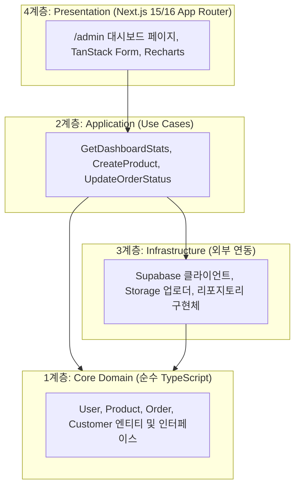

# [Hands-on 1] Claude Code로 만드는 쇼핑몰 관리자 대시보드 (Day 2 전반부)

> **"Day 1이 '보이는 것'을 빠르게 만드는 실습이었다면, Day 2는 진짜 데이터가 흐르는 제품을 만듭니다."**
> `CLAUDE.md`로 클린 아키텍처를 강제하고, Supabase에 실제 DB를 올린 뒤,
> **내 데이터로 채워진 관리자 대시보드**를 화면에 띄우는 것까지가 이번 실습의 목표입니다.

> **선행**: Claude Code 장표 Part 1~2 (기초 / 실전 워크플로우)
> **다음**: [Hands-on 2 — MCP와 스킬로 자동화하기](HANDS_ON_ADMIN_DASHBOARD_2.md)

---

## 📌 0. 실습 개요

### 0.0 ⏱️ 진행 로드맵

| 절 | 내용 | 배정 시간 |
| :--- | :--- | :--- |
| 1 | 프로젝트 셋업 & `CLAUDE.md` 주입 | 30분 |
| 2 | Supabase 스키마·시드·**관리자 계정** 구축 | 50분 |
| 3 | 대시보드 화면 + Mock 데이터로 확인 | 55분 |
| 4 | 관리자 로그인 & 경로 보호 | 30분 |

#### ↩️ AI가 코드를 망쳤을 때 — `/rewind`

실습 중 가장 자주 겪는 상황은 **"방금 요청 한 번에 잘 돌던 코드가 망가진 것"** 입니다.
이때는 파일을 하나씩 되돌리지 말고 `/rewind`를 쓰세요.

```text
/rewind
```
> 입력창이 비어 있을 때 `Esc`를 두 번 눌러도 같은 메뉴가 열립니다.

세션에서 내가 보낸 프롬프트 목록이 뜨고, 돌아갈 지점을 고른 뒤 아래에서 선택합니다.

| 선택지 | 동작 |
| :--- | :--- |
| Restore code and conversation | 코드와 대화를 그 시점으로 함께 되돌림 |
| Restore code | 대화는 두고 **파일만** 되돌림 |
| Restore conversation | 코드는 두고 **대화만** 되돌림 |

> [!CAUTION]
> `/rewind`가 되돌리지 **못하는** 것이 있습니다.
> - **터미널 명령으로 바뀐 것**: `npm install`, `create-next-app`, Supabase 마이그레이션 등은 대상이 아닙니다.
> - **내가 에디터에서 직접 고친 파일**: Claude가 편집 도구로 만든 변경만 추적됩니다.
>
> 그래서 `/rewind`가 있어도 **각 절이 끝날 때마다 `git commit`** 하는 습관은 그대로 가져가세요.
> `/rewind`는 세션 안에서의 빠른 복구, git은 영구 안전망입니다.

#### 🧷 커밋하는 습관

절이 끝날 때마다 커밋해 두면 되돌아갈 지점이 생깁니다.

```bash
git add -A && git commit -m "2절 Supabase 구축 완료"
```

---

### 0.1 실습 목표
- **아키텍처 주도 AI 코딩**: AI가 스파게티 코드를 양산하지 못하도록 `CLAUDE.md`로 클린 아키텍처 규칙을 강제합니다.
- **풀스택 인프라 원샷 구축**: Supabase PostgreSQL 스키마, RLS 보안 정책, Storage 파일 업로드 버킷까지 CLI로 자동 마이그레이션합니다.
- **엔터프라이즈 UI 스택**: TanStack Form + Zod로 복잡한 입력 폼을 타입 세이프하게 검증하고, Recharts로 고급 대시보드 시각화를 완성합니다.

### 0.2 클린 아키텍처 (Clean Architecture) 4계층 구조
AI에게 비즈니스 로직과 UI 프레임워크를 철저히 분리하도록 명령합니다.



---

## 🛠️ 1. 프로젝트 셋업 & Claude Code 프로젝트 지침(`CLAUDE.md`) 주입

### 1.1 프로젝트 디렉터리 생성 및 필수 패키지 설치
Cursor 내장 터미널을 열고 다음 명령어를 실행합니다.

#### macOS / Linux
```bash
# 1. Next.js App Router 프로젝트 생성 (TypeScript, Tailwind, ESLint 포함)
npx create-next-app@latest ecommerce-admin --typescript --tailwind --eslint --app --src-dir --import-alias "@/*" --use-npm
cd ecommerce-admin

# 2. 풀스택 필수 패키지 일괄 설치
npm install @supabase/supabase-js @supabase/ssr @tanstack/react-form zod recharts lucide-react clsx tailwind-merge

# 3. Vitest & 테스팅 도구 설치 (개발 의존성)
npm install -D vitest @vitest/coverage-v8 @testing-library/react @testing-library/jest-dom @vitejs/plugin-react jsdom
```

#### Windows (PowerShell)
```powershell
npx create-next-app@latest ecommerce-admin --typescript --tailwind --eslint --app --src-dir --import-alias "@/*" --use-npm
cd ecommerce-admin
npm install @supabase/supabase-js @supabase/ssr @tanstack/react-form zod recharts lucide-react clsx tailwind-merge
npm install -D vitest @vitest/coverage-v8 @testing-library/react @testing-library/jest-dom @vitejs/plugin-react jsdom
```

### 1.2 `CLAUDE.md` 프로젝트 지침 작성

프로젝트 루트(`ecommerce-admin/`)에 `CLAUDE.md` 파일을 만들고 **아래 내용을 그대로 복사해 붙여넣습니다.**

> [!IMPORTANT]
> `CLAUDE.md`는 Claude Code가 작업을 시작할 때 자동으로 읽는 프로젝트 지침입니다.
> 아키텍처 계층과 TDD 원칙이 여기에 정의되어 있어야 AI가 단일 파일에 모든 코드를 때려박는 실수를 방지할 수 있습니다.
> 오늘 실습 내내 이 파일이 모든 프롬프트의 배경이 됩니다.

````markdown
# CLAUDE.md - 쇼핑몰 관리자 대시보드 프로젝트 지침

이 문서는 본 프로젝트의 최상위 아키텍처 규칙 및 개발 표준입니다. 모든 코드 생성 및 리팩토링 시 이 규칙을 최우선으로 준수해야 합니다.

---

## 1. 아키텍처 원칙: 클린 아키텍처 (Clean Architecture)

본 프로젝트는 의존성 역전 원칙(DIP)에 기반한 클린 아키텍처 4계층 구조를 엄격히 준수합니다.

```
프로젝트 루트/
├── core/
│   ├── domain/               # 1계층: 엔티티 및 비즈니스 규칙 (프레임워크 완전 독립)
│   │   ├── entities/         # User, Product, Order, Customer 엔티티 타입 정의
│   │   └── repositories/     # 리포지토리 인터페이스 정의 (IProductRepository 등)
│   └── application/          # 2계층: 유스케이스 및 비즈니스 로직 조율
│       └── use-cases/        # GetDashboardStatsUseCase, CreateProductUseCase 등
├── infrastructure/           # 3계층: 외부 연동 및 프레임워크 구현체
│   ├── supabase/             # Supabase Client 및 Auth/Storage 헬퍼
│   └── repositories/         # SupabaseProductRepository 등 리포지토리 구현체
└── src/
    └── app/                  # 4계층: Next.js App Router (프레젠테이션)
        ├── (auth)/login/     # 관리자 로그인 페이지
        └── admin/            # 관리자 대시보드 레이아웃 및 10대 화면
            ├── components/   # UI 컴포넌트, TanStack Form, Recharts 차트
            ├── products/     # 상품 목록 및 등록/수정
            ├── orders/       # 주문 목록 및 상세
            ├── customers/    # 고객 목록 및 상세
            └── analytics/    # 매출 분석
```

### 계층별 의존성 규칙 (Dependency Rule)
- `core/domain`은 어떠한 외부 라이브러리(Next.js, Supabase, React 등)에도 의존해서는 안 됩니다. 순수 TypeScript 인터페이스/타입만 포함합니다.
- `core/application`은 `core/domain`에만 의존하며, 유스케이스 단위 클래스/함수로 작성합니다.
- `infrastructure`는 `core`의 인터페이스를 구현하며, Supabase SDK나 외부 API를 다룹니다.
- `src/app` (Presentation)은 UI 렌더링에만 집중하고, 데이터 조작은 반드시 `application` 계층의 유스케이스를 호출하여 수행합니다.

---

## 2. 테스트 주도 개발 (TDD) 원칙

- **Red-Green-Refactor 사이클 강제**: 새로운 기능 구현 시 반드시 실패하는 Vitest 단위/통합 테스트를 먼저 작성합니다.
- **테스트 커버리지**: 비즈니스 로직(`core/application`, `core/domain`)의 단위 테스트 커버리지는 80% 이상을 유지합니다.
- **테스트 실행 명령**:
  - 단일 테스트: `npm run test -- <파일명>`
  - 전체 테스트: `npm run test:run`
  - 커버리지 확인: `npm run test:coverage`

---

## 3. 기술 스택 & 라이브러리 표준

- **Framework**: Next.js 16 App Router, TypeScript (Strict Mode)
- **Styling**: Tailwind CSS, lucide-react (아이콘)
- **Backend & Auth & Storage**: Supabase (@supabase/supabase-js, @supabase/ssr)
  - 상품 이미지 버킷: `product-images` (Public Read, Authenticated Write)
  - 공개 키는 `process.env.NEXT_PUBLIC_SUPABASE_PUBLISHABLE_DEFAULT_KEY ?? process.env.NEXT_PUBLIC_SUPABASE_ANON_KEY` 순으로 fallback 처리합니다.
  - Secret/Service Role 키(`SUPABASE_SECRET_KEY`)는 **서버 코드에서만** 참조하며, 절대 `NEXT_PUBLIC_` 접두사를 붙이지 않습니다.
- **AI 어시스턴트 (선택 기능)**: `@langchain/core` + `@langchain/anthropic`, 모델 ID는 **`claude-haiku-4-5`** 고정
  - 구버전 ID(`claude-3-5-haiku-latest`)나 날짜 suffix(`claude-haiku-4-5-20251001`)를 쓰지 않습니다.
  - 공식 SDK(`@anthropic-ai/sdk`)를 직접 호출하지 않고 LangChain 인터페이스를 경유합니다. (제공자 교체 용이성)
  - AI 응답 형식은 문자열 파싱이 아니라 `model.withStructuredOutput(zodSchema)`로 강제합니다.
- **Form & Validation**: `@tanstack/react-form` + `zod`
  - 폼 입력 검증 시 반드시 Zod 스키마를 정의하고 인풋 필드별 인라인 에러 메시지를 표시합니다.
- **Charts**: `recharts` (ResponsiveContainer, AreaChart, BarChart, PieChart)
- **Testing**: `vitest`, `@testing-library/react`, `@testing-library/jest-dom`

---

## 4. 코딩 컨벤션 & 품질 수칙

1. **Client vs Server 컴포넌트**:
   - 상태(`useState`), 폼 인터랙션, 차트(`recharts`), 드래그앤드롭이 있는 파일은 파일 최상단에 반드시 `'use client'`를 명시합니다.
2. **에러 핸들링**:
   - Supabase 호출 결과의 `error` 객체는 반드시 확인하고 사용자 친화적인 메시지로 변환합니다.
3. **타입 안전성**:
   - `any` 타입 사용을 엄격히 금지합니다. 모든 API 응답과 폼 데이터는 명시적 인터페이스/Zod 추론 타입을 사용합니다.
4. **diff 기반 수정**:
   - 기존 코드를 리팩토링할 때는 전체 파일을 덮어쓰지 않고 필요한 변경 부분만 최소한으로 수정합니다.

---

## 5. MCP (Model Context Protocol) 도구 활용 수칙

- **Supabase MCP** (`@supabase/mcp-server-supabase`): 스키마 구조 파악, 테이블 데이터 무결성 검증, RLS 정책 점검 시 활성화된 Supabase MCP 도구를 우선 호출하여 검증합니다.
- **Playwright MCP** (`@playwright/mcp`): 화면 구현 후 E2E 브라우저 동작 검증 및 시각적 UI 렌더링 확인 시 Playwright 브라우저 제어 도구를 활용하여 자동 검증 및 스크린샷을 생성합니다.
- MCP 서버가 연결되지 않은 상태라면 임의로 대체 수단을 만들지 말고 사용자에게 `/mcp` 연결 상태 확인을 요청합니다.

---

## 6. 데이터가 비어 보일 때의 1순위 점검 항목

관리자 화면의 목록/차트가 비어 있다면 **코드 버그보다 RLS 권한 문제일 가능성이 높습니다.**
아래를 먼저 확인한 뒤 코드를 수정합니다.

1. 현재 로그인 세션이 존재하는가? (`supabase.auth.getUser()`)
2. `public.users`에서 해당 사용자의 `role`이 `'admin'`인가?
   ```sql
   select id, email, role from public.users where role = 'admin';
   ```
3. `orders` / `customers` / `order_items`는 `public.is_admin()` 정책으로 **관리자에게만** 노출됩니다.
   비관리자 세션에서는 빈 배열이 반환되며 **에러가 발생하지 않으므로** 조용히 실패합니다.
4. 서버 컴포넌트에서 쿠키 기반 세션을 넘기지 않고 클라이언트를 생성하면 익명 세션이 됩니다.
   `@supabase/ssr`의 서버 클라이언트를 사용했는지 확인합니다.
````

> [!TIP]
> 지금은 통째로 복사하지만, **실무에서는 이 파일을 처음부터 다 쓰지 않습니다.**
> 프로젝트를 진행하면서 "AI가 자꾸 이걸 틀리네" 싶은 규칙을 한 줄씩 추가해 나가는 게 일반적입니다.
> 위 6번 항목(데이터가 비어 보일 때)도 그렇게 쌓인 규칙입니다.

### 1.3 Claude Code 실행 및 아키텍처 인지 확인
Cursor 내장 터미널에서 Claude Code를 구동하고 규칙을 잘 이해했는지 테스트합니다:

```bash
claude
```

**[Claude Code 프롬프트]**
```text
프로젝트 루트의 CLAUDE.md를 정독하고, 본 프로젝트의 클린 아키텍처 4계층(core/domain, core/application, infrastructure, src/app)과 TDD 개발 원칙을 3줄로 요약해줘.
```

### 1.4 [첫 작업] 테스트 환경 설정을 프롬프트로 만들기

설정 파일도 직접 타이핑하지 않습니다. **첫 프롬프트로 Claude Code에게 시킵니다.**

**[Claude Code 프롬프트]**
```text
Vitest 테스트 환경을 설정해줘.

1. vitest.config.ts 생성
   - @vitejs/plugin-react 플러그인 사용
   - test: environment는 'jsdom', globals는 true, setupFiles는 './vitest.setup.ts'
   - resolve.alias: '@' -> ./src, '@core' -> ./core, '@infra' -> ./infrastructure
2. vitest.setup.ts 생성
   - @testing-library/jest-dom/vitest 를 import 하는 한 줄
3. package.json의 scripts에 추가
   - "test": "vitest", "test:run": "vitest run", "test:coverage": "vitest run --coverage"

만든 뒤 npm run test:run 을 실행해서 설정이 정상인지 확인해줘.
(아직 테스트 파일이 없으므로 "No test files found"가 나오면 성공이야.)
```

> [!CAUTION]
> **`vitest.setup.ts`가 실제로 만들어졌는지 꼭 확인하세요.**
> `vitest.config.ts`의 `setupFiles`가 가리키는 이 파일이 없으면 **테스트가 한 건도 실행되지 않고 즉시 에러**로 끝납니다.
> 후반부 실습의 TDD가 시작부터 막히는 가장 흔한 원인입니다.
>
> ```bash
> ls vitest.config.ts vitest.setup.ts
> ```

<details>
<summary>📄 결과가 다르게 나왔다면 — 정답 설정 파일 펼쳐보기</summary>

```typescript
// vitest.config.ts
import { defineConfig } from 'vitest/config';
import react from '@vitejs/plugin-react';
import path from 'path';

export default defineConfig({
  plugins: [react()],
  test: {
    environment: 'jsdom',
    globals: true,
    setupFiles: './vitest.setup.ts',
  },
  resolve: {
    alias: {
      '@': path.resolve(__dirname, './src'),
      '@core': path.resolve(__dirname, './core'),
      '@infra': path.resolve(__dirname, './infrastructure'),
    },
  },
});
```

```typescript
// vitest.setup.ts
import '@testing-library/jest-dom/vitest';
```

</details>

> [!TIP]
> 설정 파일 하나도 직접 안 쓰는 게 과해 보일 수 있습니다. 하지만 이게 이 실습의 기본 자세입니다.
> **"내가 아는 걸 AI에게 정확히 시키는 연습"** 이지, AI에게 알아서 하라고 맡기는 게 아닙니다.
> 위 프롬프트도 결국 원하는 설정값을 하나하나 지정하고 있다는 점을 보세요.

---

## 🗄️ 2. Supabase 백엔드 인프라 자동 구축

> [!NOTE]
> **💡 시니어 엔지니어의 인프라 전략: Supabase CLI vs Supabase MCP**  
> 실무에서 가장 많이 나오는 질문: *"CLI와 MCP 중 무엇을 써야 하나요?"*
>
> | 구분 | **Supabase CLI (`npx supabase db push`)** | **Supabase MCP** |
> | :--- | :--- | :--- |
> | **역할** | **인프라 생성 및 배포 (IaC / 버전 관리)** | **AI 에이전트의 실시간 조회 & 검증 (눈과 귀)** |
> | **사용 시점** | 최초 스키마/Storage 생성 및 마이그레이션 배포 시 | 배포 후 AI가 코딩하며 DB/스토리지 상태를 확인할 때 |
> | **실무 가치** | Git으로 스키마 버전 관리, `db push` 한 줄로 원샷 배포 | 웹 콘솔 창 전환 없이 터미널 안에서 즉시 셀프 검증 |
>
> 👉 **결론**: **"배포는 CLI로 견고하게, 확인은 MCP로 스마트하게!"** 두 도구는 대체 관계가 아니라 상호보완적인 파트너입니다.
> (MCP는 후반부 실습에서 직접 붙여봅니다.)

### 2.1 Supabase 프로젝트 생성 및 CLI 연동

먼저 [Supabase Dashboard](https://supabase.com/dashboard)에서 **New project**로 새 프로젝트를 만듭니다.
(이름: `ecommerce-admin`, Region: `Northeast Asia (Seoul)`)

> [!NOTE]
> **프로젝트 생성 화면의 `Advanced Configuration ➡️ Security`는 셋 다 기본값 그대로 두세요.**
>
> | 항목 | 기본값 | 실습 설정 | 이유 |
> | :--- | :--- | :--- | :--- |
> | Enable Data API | ✅ 켬 | **그대로 켬** | `supabase-js`가 사용하는 PostgREST 엔드포인트입니다. 끄면 클라이언트 라이브러리 자체가 동작하지 않습니다. |
> | Automatically expose new tables | ✅ 켬 | **그대로 켬** | 끄면 마이그레이션으로 만든 테이블에 Data API 권한(GRANT)이 부여되지 않아, RLS 정책이 정확해도 `permission denied` 또는 빈 배열이 반환됩니다. |
> | Enable automatic RLS | ⬜ 끔 | **그대로 끔** | `schema.sql`이 테이블별로 `enable row level security`를 명시적으로 실행하므로 불필요합니다. |
>
> 💡 **화면의 "We recommend disabling this"를 따르지 마세요.** 그 권장은 운영 환경 기준입니다.
> 실습에서 두 번째 항목을 끄면 *"마이그레이션도 성공하고 Table Editor에 데이터도 보이는데 앱에서만 빈 화면"* 이라는
> 원인 추적이 극도로 어려운 상황이 발생합니다.
> 세 번째 항목을 켜면 이후 실습 중 새로 만드는 테이블마다 정책 없는 RLS가 자동으로 걸려 조용히 빈 결과를 반환합니다.

프로젝트가 준비되면, 웹 콘솔에서 하나씩 클릭하는 대신 프로덕션 환경처럼 CLI 마이그레이션으로 DB 스키마와 Storage 버킷을 원샷 배포합니다.

> [!TIP]
> 아래 명령은 `npx`로 실행하므로 별도 설치 없이 바로 됩니다. `npx`가 매번 새로 받느라 느리다면
> 프로젝트에 devDependency로 추가해두세요 (Windows도 동일하게 동작, Scoop 불필요):
> ```bash
> npm install supabase --save-dev
> ```
> 이후에도 명령은 그대로 `npx supabase ...`로 씁니다.
>
> 전역 `supabase` 명령을 쓰고 싶다면 Windows는 [Scoop](https://scoop.sh) 설치가 먼저 필요합니다.
> 자세한 설치 방법: [Supabase CLI — Getting Started](https://supabase.com/docs/guides/local-development/cli/getting-started?queryGroups=platform&platform=windows)

```bash
# 1. Supabase 로그인 (브라우저 인증)
npx supabase login

# 2. Supabase 프로젝트 연결 (대시보드 Settings -> General -> Reference ID 입력)
npx supabase link --project-ref <YOUR_PROJECT_REF>
```

### 2.2 통합 마이그레이션 파일 적용 (`schema.sql`)
제공된 `schema.sql`(이 실습 폴더 안에 있음) 내용을 Supabase 마이그레이션 파일로 복사합니다.

```bash
# 마이그레이션 파일 생성
npx supabase migration new initial_ecommerce_schema
```

생성된 `supabase/migrations/<TIMESTAMP>_initial_ecommerce_schema.sql` 파일에 제공된 `schema.sql` 전체 내용을 붙여넣고 푸시합니다:

```bash
# 원격 Supabase DB 및 Storage에 마이그레이션 적용
npx supabase db push
```

> [!TIP]
> **마이그레이션 완료 후 확인 사항**:
> 1. Supabase 대시보드 `Table Editor`에서 `users`, `products`, `orders`, `order_items`, `customers` 테이블 확인
>    - `products` 10건 / `customers` 12건 / `orders` 60건 / `order_items` 100건 내외가 들어있어야 합니다.
> 2. `Storage` 메뉴에서 `product-images` 버킷이 Public 상태로 생성되었는지 확인

### 2.3 ⚠️ [필수] 관리자 계정 생성 및 권한 승격

> [!CAUTION]
> **이 단계를 건너뛰면 3절 이후 모든 화면이 빈 화면으로 나옵니다.**
> `schema.sql`의 RLS 정책은 주문/고객/사용자 조회를 **관리자에게만** 허용하는데,
> 신규 가입자는 트리거에 의해 무조건 `role='customer'`로 생성되기 때문입니다.
> 원인이 RLS라서 화면만 봐서는 절대 알 수 없습니다. 반드시 지금 처리하세요.

**1) 관리자 계정 생성**
Supabase 대시보드 ➡️ **Authentication ➡️ Users ➡️ [Add user] ➡️ [Create new user]**

| 항목 | 값 |
| :--- | :--- |
| Email | `admin@shop.com` |
| Password | `admin1234!` |
| Auto Confirm User | ✅ 체크 (이메일 인증 생략) |

이 화면에서 입력할 수 있는 건 위 세 가지뿐입니다. **권한(role)은 여기서 지정할 수 없습니다.**
지금 만든 계정은 트리거에 의해 `role='customer'` 상태입니다.

**2) role을 admin으로 승격**
**SQL Editor**에서 다음을 실행합니다. **이 쿼리를 실행해야 비로소 관리자가 됩니다.**

```sql
update public.users set role = 'admin' where email = 'admin@shop.com';

-- 아래 쿼리가 1행을 반환하면 정상입니다.
select id, email, role from public.users where role = 'admin';
```

> [!NOTE]
> `select` 결과가 **0행**이라면 1)에서 만든 계정이 `public.users`에 아직 없는 것입니다.
> `schema.sql`의 트리거가 `auth.users` 가입 시 `public.users` 행을 자동 생성하는데,
> **계정을 트리거보다 먼저 만들었다면** 행이 없을 수 있습니다. 이때는 계정을 지우고 다시 만드세요.

> [!TIP]
> 4절에서 만들 로그인 화면에 바로 이 계정(`admin@shop.com` / `admin1234!`)으로 로그인하게 됩니다.
> 계정 정보를 메모해 두세요.

### 2.4 환경 변수 설정 (`.env.local`)
프로젝트 루트에 `.env.local` 파일을 생성하고 Supabase 키를 입력합니다.
대시보드 상단 **[Connect] ➡️ [Framework]** 탭에서 `Framework: Next.js` / `Variant: App Router`를 선택한 뒤,
아래 **[Follow these steps] ➡️ 2. Add files ➡️ `.env.local` 탭**의 값을 그대로 복사하면 됩니다.
(`Shadcn` 토글은 꺼둡니다.)

```bash
NEXT_PUBLIC_SUPABASE_URL=https://<YOUR_PROJECT_REF>.supabase.co

# 공개 키 (브라우저 노출 OK)
NEXT_PUBLIC_SUPABASE_PUBLISHABLE_DEFAULT_KEY=sb_publishable_xxxxxxxxxxxx
# 구 프로젝트라 anon 키만 보이면 이쪽을 사용
# NEXT_PUBLIC_SUPABASE_ANON_KEY=eyJhbGciOi...

# 비공개 키 (서버 전용 / 절대 클라이언트에 노출 금지)
SUPABASE_SECRET_KEY=sb_secret_xxxxxxxxxxxx
# 구 프로젝트: SUPABASE_SERVICE_ROLE_KEY=<YOUR_SERVICE_ROLE_KEY>
```

> [!IMPORTANT]
> **키 이름이 인터넷 자료나 영상과 다를 수 있습니다.** 2025년 이후 생성한 Supabase 프로젝트는
> `anon` / `service_role` 대신 **Publishable / Secret 키** 체계가 기본입니다. 콘솔에서 anon 키가 안 보여도 정상입니다.
>
> 그리고 **Secret 키는 절대 `NEXT_PUBLIC_` 접두사를 붙이지 마세요.** 붙이는 순간 브라우저 번들에 포함되어
> RLS를 통째로 우회할 수 있는 키가 공개됩니다. 서버 컴포넌트/라우트 핸들러에서만 사용합니다.

## 📊 3. 대시보드 화면 만들기 (KPI · 차트 · 최근 주문)

2절에서 넣은 시드 데이터를 화면으로 끌어올립니다. **로그인은 아직 붙이지 않습니다.**

> [!NOTE]
> **실무 개발자의 AI 페어 프로그래밍 팁 (병렬 터미널)**:  
> Cursor 터미널을 분할(`Split Terminal`)해 두 개의 독립된 `claude` 세션을 돌리면 작업 속도를 크게 끌어올릴 수 있습니다.
>
> 다만 **아무 작업이나 병렬로 돌리면 오히려 느려집니다.** 두 세션이 같은 파일을 건드리면
> 서로의 수정을 덮어써서 디버깅에 더 많은 시간을 쓰게 됩니다. 다음 조건을 지키세요.
>
> - ✅ **안전**: 서로 다른 라우트 디렉터리 작업 (예: 탭1 `app/admin/orders/`, 탭2 `app/admin/customers/`)
> - ❌ **위험**: 공용 엔티티(`core/domain/entities/`), 사이드바 레이아웃, `CLAUDE.md` 등 공유 파일 동시 수정
> - 💡 **권장**: 공용 파일(엔티티·레이아웃)을 **먼저 한 세션에서 만들어 커밋한 뒤** 병렬로 갈라지기
>
> 처음이라면 **단일 세션으로 진행**하세요. 병렬은 익숙해진 뒤에 시도해도 늦지 않습니다.

### 3.1 대시보드 메인 (`/admin/page.tsx`)
KPI 지표 카드와 매출 그래프, 최근 주문 목록을 구현합니다.

**[Claude Code 프롬프트]**
```text
쇼핑몰 관리자 메인 대시보드(/admin)를 구현해줘.

1. 계층 분리:
   - core/domain/entities/dashboard.ts: DashboardStats (오늘 매출, 신규 주문, 신규 고객, 재고 부족 상품수)
   - core/application/use-cases/get-dashboard-stats.usecase.ts: 통계 계산 유스케이스
   - infrastructure/repositories/supabase-dashboard.repository.ts: Supabase DB 연동

2. 화면 구성 (src/app/admin/page.tsx):
   - 상단: 4대 KPI 지표 카드 (오늘 매출 금액, 신규 주문 N건, 신규 고객 N명, 재고 부족 N개)
   - 중단 좌측: 주간 매출 추이 (Recharts의 ResponsiveContainer와 AreaChart 활용, 부드러운 그라데이션)
   - 중단 우측: 카테고리별 판매 비율 (Recharts의 PieChart)
   - 하단: 최근 주문 목록 테이블 (주문번호, 고객명, 상품명, 결제금액, 배송상태 뱃지)
   - 사이드바 네비게이션: 대시보드, 상품 관리, 주문 관리, 고객 관리, 매출 분석, 스토어 설정
```


> [!TIP]
> 구현이 끝나면 바로 확인해봅니다.
> ```bash
> npm run dev
> ```
> 브라우저에서 `http://localhost:3000/admin` 을 열어보세요.

---

### 3.2 [진단] 원하는 결과가 아닌 경우

여기서 아마도 원하는 결과가 안 나올 겁니다.

원인 분석 및 디버깅 시간을 가져보세요.


### 3.3 Mock 리포지토리로 화면 먼저 완성하기

여기서 클린 아키텍처가 힘을 발휘합니다. 3.1에서 **리포지토리 인터페이스**를 이미 정의해뒀으니,
같은 인터페이스를 구현한 **가짜(Mock) 구현체**를 하나 더 만들어 끼우면 됩니다.
UI도 유스케이스도 한 줄도 고치지 않습니다.

```
IDashboardRepository (인터페이스)
   ├─ SupabaseDashboardRepository   ← 3.1에서 만든 것 (지금은 빈 데이터)
   └─ MockDashboardRepository       ← 지금 만들 것 (화면 확인용)
```

**[Claude Code 프롬프트]**
```text
로그인 없이도 대시보드 화면을 확인할 수 있도록 Mock 리포지토리를 추가해줘.

1. supabase/migrations/ 아래의 마이그레이션 SQL을 먼저 읽고, 실제 테이블 구조와 시드 데이터를 그대로 따라줘.
   - 컬럼명과 타입, 특히 주문 상태(status)와 상품 카테고리에 쓰이는 값을 SQL에 있는 문자열 그대로 사용할 것
   - 데이터 규모도 비슷하게: 상품 10건, 고객 12건, 주문 60건 내외
   - 매출 추이 차트가 밋밋하지 않도록 날짜별로 값에 변화를 줄 것

2. infrastructure/repositories/mock-dashboard.repository.ts 를 만들어줘.
   - 3.1에서 정의한 리포지토리 인터페이스를 그대로 구현할 것
   - 기존 supabase-dashboard.repository.ts 는 지우지 말고 그대로 둘 것

3. 환경 변수로 둘을 전환할 수 있게 해줘.
   - .env.local 에 NEXT_PUBLIC_USE_MOCK=true 를 추가
   - 이 값이 true면 Mock을, 아니면 Supabase 구현체를 주입
   - 주입 지점은 한 곳으로 모아줘 (예: infrastructure/repositories/index.ts)

4. UI 컴포넌트와 유스케이스 코드는 절대 수정하지 마. 구현체 교체만으로 동작해야 해.
```

다시 `http://localhost:3000/admin` 을 열어보세요. **같은 화면에 데이터가 가득 차 있을 것입니다.**

> [!IMPORTANT]
> 방금 무슨 일이 일어났는지 짚고 갑니다.
> **화면과 비즈니스 로직은 그대로 두고, 데이터를 가져오는 구현체만 갈아끼웠습니다.**
> `CLAUDE.md` 1절의 의존성 역전 원칙(DIP)이 말로만 있는 규칙이 아니라는 걸 방금 직접 확인한 셈입니다.
>
> 후반부 실습의 TDD에서도 같은 구조를 씁니다. 테스트가 진짜 DB 없이 도는 이유가 바로 이것입니다.

> [!CAUTION]
> `NEXT_PUBLIC_USE_MOCK=true`는 **화면을 다듬는 동안만 쓰는 임시 스위치**입니다.
> 4절에서 로그인을 붙인 뒤 반드시 `false`로 되돌립니다. 켜둔 채로 진행하면
> 실제 DB가 연결되지 않은 것을 눈치채지 못한 채 후반부 실습까지 가게 됩니다.

### 3.4 매출 분석 (`/admin/analytics/page.tsx`) & 스토어 설정 (`/admin/settings/page.tsx`)

**[Claude Code 프롬프트]**
```text
다음 두 페이지를 추가 구현해줘:
1. 매출 분석 (/admin/analytics):
   - 기간 필터 (최근 7일, 이번 달, 최근 3개월)
   - 일자별 매출 및 주문 건수 복합 차트 (Recharts Bar + Line 차트)
   - 베스트셀러 TOP 5 상품 테이블
2. 스토어 설정 (/admin/settings):
   - 쇼핑몰 기본 정보 (상호명, 대표자명, 고객센터 연락처)
   - 기본 배송비 및 무료배송 기준 금액 설정 폼
   - 저장 완료 시 토스트 피드백 표시
```

> [!TIP]
> 이 두 페이지도 Mock 데이터로 바로 확인됩니다. **디자인을 자유롭게 다듬어보세요.**
> `Cmd+K`로 색을 바꾸거나 카드 배치를 조정해도 데이터가 계속 보이니 피드백이 빠릅니다.

---

## 🔐 4. 관리자 로그인 & 경로 보호

방금 만든 대시보드는 **주소만 알면 누구나 들어옵니다.** 이제 자물쇠를 겁니다.

### 4.1 로그인 화면과 미들웨어


**[Claude Code 프롬프트]**
```text
src/app/(auth)/login/page.tsx에 깔끔한 모던 관리자 로그인 화면을 구현해줘.
- 이메일, 비밀번호 입력 필드와 로그인 버튼
- 로그인 성공 시 LoginUseCase를 호출하고 '/admin'으로 리다이렉트
- 일반 사용자거나 미인증 시 에러 메시지 알림 표시
- src/middleware.ts를 생성하여 '/admin' 하위 경로에 비관리자가 접근할 경우 '/login'으로 강제 리다이렉트하도록 구현해줘.
```

### 4.2 Mock 스위치 끄고 실제 DB 연결하기

이제 관리자로 로그인할 수 있으니 **가짜 데이터를 쓸 이유가 없어졌습니다.**
`.env.local`의 스위치를 내립니다.

```bash
# .env.local
NEXT_PUBLIC_USE_MOCK=false
```

개발 서버를 재시작합니다. (`.env.local` 변경은 재시작해야 반영됩니다.)

```bash
npm run dev
```

> [!TIP]
> **Mock 구현체는 지우지 마세요.** 후반부 실습의 테스트에서 다시 씁니다.
> 스위치 하나로 진짜와 가짜를 오갈 수 있다는 것 자체가 이 구조의 이점입니다.

### 4.3 동작 확인

2절에서 만든 관리자 계정으로 최종 확인합니다.

1. 로그아웃 상태에서 `http://localhost:3000/admin` 접속 ➡️ `/login`으로 튕겨야 정상
2. `admin@shop.com` / `admin1234!` 로 로그인 ➡️ 대시보드 진입
3. **3.1에서 봤던 빈 화면이 이번엔 실제 데이터로 채워져 있어야 합니다**

> [!CAUTION]
> 여전히 숫자가 0이라면 둘 중 하나입니다.
> - `NEXT_PUBLIC_USE_MOCK`을 끄지 않아 여전히 Mock을 보고 있는지 확인 (반대로 껐는데 0이면 아래 항목)
> - **2.3절 관리자 승격 SQL**을 실행하지 않아 아직 `role='customer'`
>
> 판단이 안 서면 `select id, email, role from public.users where role = 'admin';` 을 다시 돌려보세요.

> [!TIP]
> 여기까지가 실습 1의 산출물입니다. 커밋해두세요.
> ```bash
> git add -A && git commit -m "관리자 대시보드 + 로그인 완성"
> ```

---

## ➡️ 다음 실습

여기까지 오면 **돌아가는 제품**이 하나 생겼습니다.
후반부에서는 이 위에 상품 등록 기능을 TDD로 붙이고, **MCP와 스킬로 AI에게 일을 시킵니다.**

- [Hands-on 2 — MCP와 스킬로 자동화하기](HANDS_ON_ADMIN_DASHBOARD_2.md)
